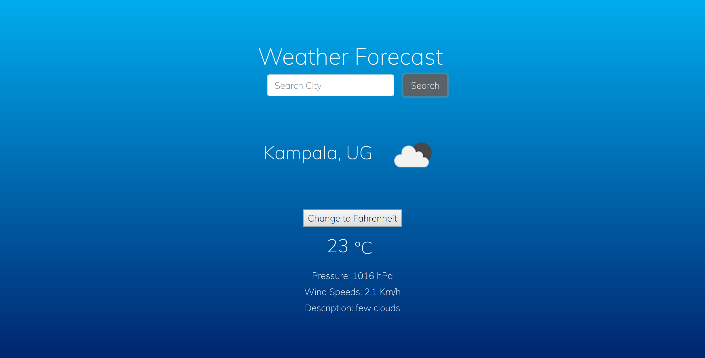

# weather-app

> Weather forecast site using the open Weather API

## Live Demo

[Live Demo Link](https://rawcdn.githack.com/rmauritsson/weather-app/feature/site-data/dist/index.html)

## About The Project

This project is about using APIs in Javascript. I created a weather forecast site using the openweather api. You can search for any city in the world to get their weather data.

## Built With
This progam was made using this technologies

* [Javascript](https://www.javascript.com/)
* [Stickler](https://stickler-ci.com/)

👤 **Author**

- Leonard Rwai Kanyesigye:
[Github](https://github.com/rmauritsson),
[Twitter](https://twitter.com/leokanye),

## 🤝 Contributing

Contributions, issues and feature requests are welcome!

Feel free to check the [issues page](issues/).

## Show your support

Give a ⭐️ if you like this project!

## 📝 License

This project is [MIT](lic.url) licensed.
